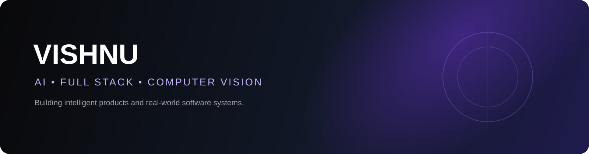

<div align="center">



<br />

<a href="https://github.com/vishnu04062004"></a>
<a href="https://github.com/vishnu04062004"></a>
<a href="https://github.com/vishnu04062004"></a>

<br /><br />

### Building intelligent products that solve real problems.

<p>
  I am Vishnu, an AI / Full-Stack Developer exploring RAG systems, LLM applications,
  computer vision, and production-ready software.
</p>

<a href="mailto:alamurivishnu18@gmail.com"></a>
<a href="https://www.linkedin.com/in/alamuri-vishnu-murthy-bb5a50283/"></a>

</div>


## Philosophy

<div align="center">

<table>
<tr>
<td align="center" width="25%"><strong>CODE</strong><br /><sub>Start with a question.</sub></td>
<td align="center" width="25%"><strong>BREAK</strong><br /><sub>Test the limits.</sub></td>
<td align="center" width="25%"><strong>FIX</strong><br /><sub>Learn from the failure.</sub></td>
<td align="center" width="25%"><strong>SHIP &#128640;</strong><br /><sub>Make it real.</sub></td>
</tr>
</table>

<h3>Code. Break. Fix. Ship. &#128640;</h3>

</div>

> **Certificates don't build things; curiosity does.** I've always learned best by rolling up my sleeves - experimenting with new technology, breaking code, fixing bugs, and shipping real projects.
>
> Chasing my curiosity is my biggest unfair advantage, and I intend to keep it that way.

## What I am building

<table>
<tr>
<td width="33%"><strong>AI products</strong><br />Useful LLM workflows, agents, and intelligent applications.</td>
<td width="33%"><strong>RAG systems</strong><br />Evidence-grounded retrieval, evaluation, and answer generation.</td>
<td width="33%"><strong>Vision systems</strong><br />Detection, tracking, sensor fusion, and safety-focused prototypes.</td>
</tr>
</table>

## Featured work

<table>
<tr>
<td width="50%">

### InterviewGraph AI
RAG-grounded technical interviews that evaluate reasoning, identify misconceptions, and generate targeted follow-ups.

</td>
<td width="50%">

### AptiMentor
Adaptive placement preparation with diagnostics, personalized practice, mock exams, and analytics.

</td>
</tr>
<tr>
<td width="50%">

### Smart Support Routing
Routes support tickets using intent, urgency, semantic similarity, and service capacity.

</td>
<td width="50%">

### AEBS
Automotive safety prototype combining camera detection, radar, tracking, sensor fusion, and TTC analysis.

</td>
</tr>
</table>

<details>
<summary><strong>More projects</strong></summary>
<br />

- **NutriWise:** Cross-platform nutrition tracking with food search, health records, and analytics.
- **CompLens:** A product-focused application built to turn complex information into useful decisions.

</details>

## Tech stack

<div align="center">


</div>

## Current trajectory

```text
AI Engineering -> LLM Applications -> RAG Systems -> AI Agents & MCP -> Production AI
```

My goal is to understand the engineering that takes AI from an exciting prototype to a dependable product.

## Pac-Man contribution command center

<div align="center">

<picture>
  <source media="(prefers-color-scheme: dark)" srcset="https://raw.githubusercontent.com/vishnu04062004/vishnu04062004/output/pacman-contribution-graph-dark.svg" />
  <source media="(prefers-color-scheme: light)" srcset="https://raw.githubusercontent.com/vishnu04062004/vishnu04062004/output/pacman-contribution-graph.svg" />
  
</picture>

<br />
<code>CONTRIBUTION SYSTEM: PAC-MAN ONLINE // SHIP SOMETHING EVERY DAY</code>

</div>

## Beyond code

Cricket | Gym | Calisthenics | Curiosity-driven experiments

## Let's build something useful

If you are working on an interesting AI, ML, or full-stack project, [let's connect](mailto:alamurivishnu18@gmail.com).

<div align="center">


</div>
